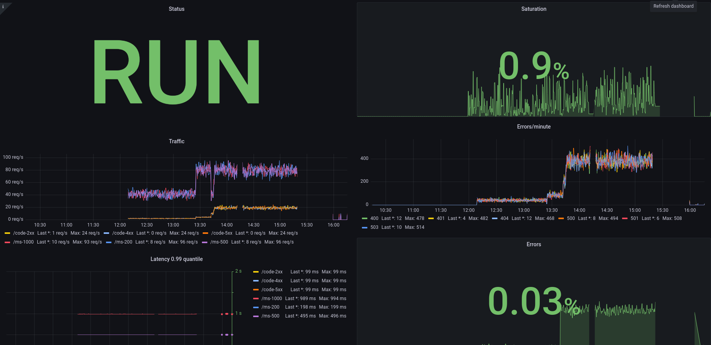
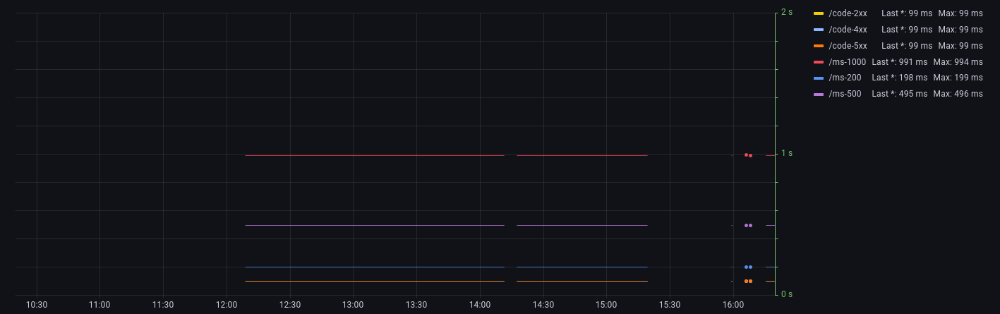
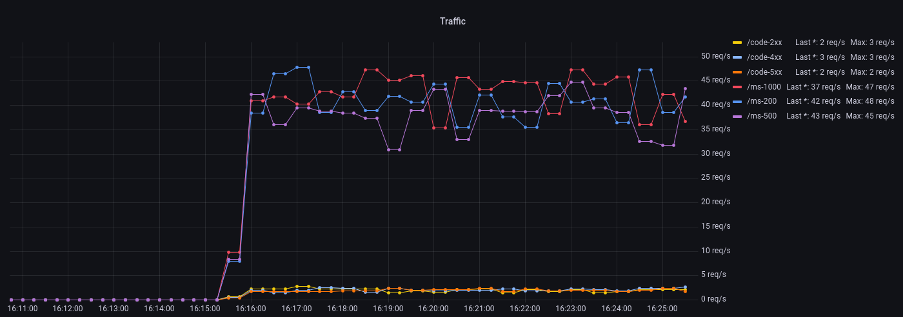
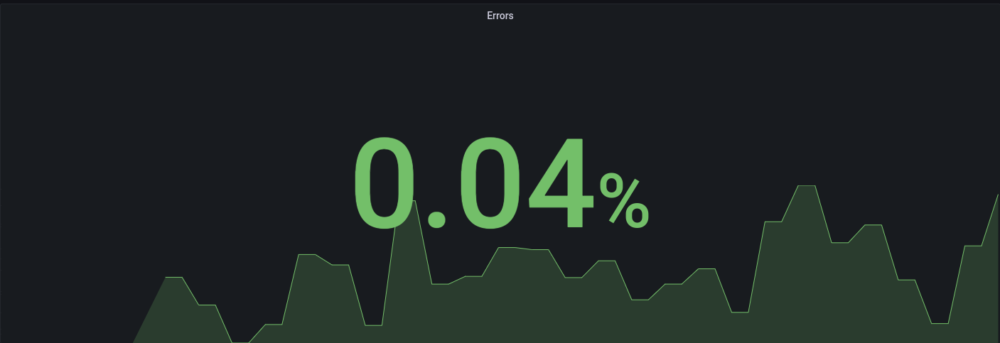
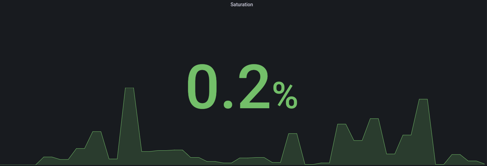
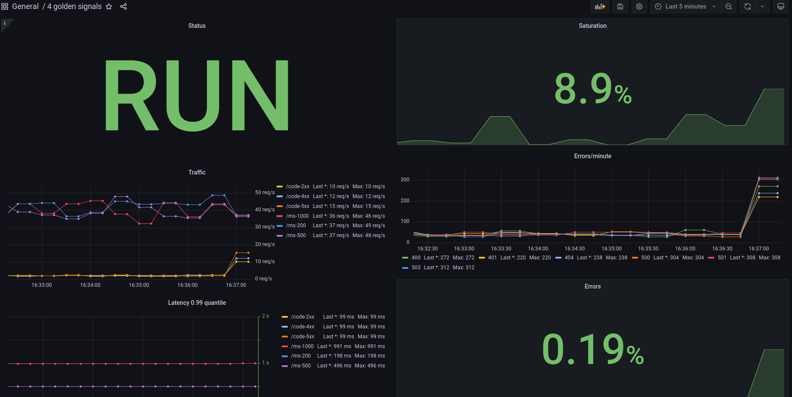
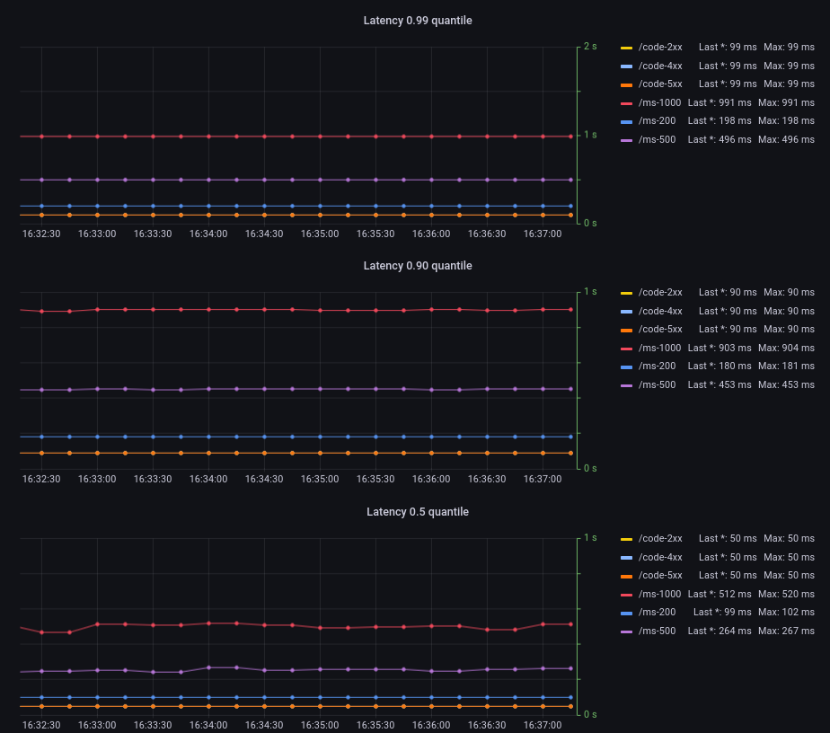

# Стратегии мониторинга

Окружение для вебинара [Prometheus + Grafana настраиваем 4 golden signals](https://slurm.io/webinars/grafana)

## Requirements

- Visual Studio Code
- Docker + docker-compose

## Структура репозитория

```
├── .vscode - конфигурация Visual Studio Code
├── configs - конфигурация Prometheus
├── dashboards - директория с dashboards
├── demoapp - демо-приложение, отдающее метрики
│   ├── cmd
│   │   ├── app - демо-приложение, отдающее метрики
│   │   └── load - скрипт для генерации нагрузки на демо-приложение
│   └── internal - внутренние библиотеки
│       ├── helpers - вспомогательные методы (e.g. генерация случайных http кодов)
│       ├── metrics - описание метрик
│       └── middleware - middleware для сбора метрик
├── docker - docker-compose файл для запуска стенда
├── .env - переменные окружения
└── docs - документация
```

## Как работать с репозиторием

1. Клонируем репозиторий и открываем его в Visual Studio Code
2. Переходим в директорию `docker` запускаем стенд через `docker-compose up -d`
3. Убеждаемся в доступности локального окружения:
   1. Убеждаемся что Prometheus доступен по адресу `localhost:9090` 
   2. Убеждаемся что Grafana доступна по адресу `localhost:3000` 
   3. Убеждаемся что в Grafana можно войти с логином и паролем по умолчанию - `admin:admin`
   4. Запускаем приложение `Load`, которое необходимо для имитации нагрузки - `F5`
   5. Убеждаемся что демо-приложение отдает метрики по адресу `localhost:8080/metrics` 

### Переменные окружения

Значение перменных окружения описаны в файле [.env](./.env). При измений значений в файле нужно перезапускать приложение (не контейнер!)

| Переменная                   | Описание                                                                               | Значение по умолчанию |
| -----------------------------| -------------------------------------------------------------------------------------- | --------------------- |
| HTTP_REQUESTS_INFLIGHT_MAX   | Максимальное количество запросов, которое приложение может обрабатывать "одновременно" | 20 |
| HTTP_REQUESTS_SUCCESSFUL_MAX | Максимальное количество запросов, которое может быть "одновременно" отправлено на эндпойнты, которые возвращают код 2xx | 15 |
| HTTP_REQUESTS_ERROR_MAX      | Максимальное количество запросов, которое может быть "одновременно" отправлено на эндпойнты, которые возвращают код >= 400 | 5 |

## Задание

1. Настраиваем в Grafana графики, которые отображают:
   - Latency
   - Traffic
   - Errors
   - Saturation
2. Пробуем различные значения переменных окружения `HTTP_REQUESTS_INFLIGHT_MAX`, `HTTP_REQUESTS_SUCCESSFUL_MAX` и `HTTP_REQUESTS_ERROR_MAX`. Смотрим как меняются графики Traffic, Errors и Saturation
3. Пробуем различные quantile'и (0.5, 0.90, 0.95, 0.99, etc.), смотрим как меняется график Latency

## Решение
1. Настройка графиков в Grafana  
   -  Готовый Dashboard

   - Latency   
   Запрос prometheus:   
   `histogram_quantile(0.99,
   sum(rate(http_request_duration_seconds_historgram_bucket{pattern!="/metrics"}[1m]))
   by (le, pattern))
   `  
    Внешний вид панели:
    
   - Traffic   
   Запрос prometheus:   
   `sum(rate(http_requests_total{pattern!="/metrics"}[1m])) by (pattern)`  
    Внешний вид панели:
    
   - Errors
      Запрос prometheus:   
   `sum(increase(http_requests_total{pattern!="/metrics", status=~"4.+|5.+"}[1m])) / sum(increase(http_requests_total{pattern!="/metrics"}[1m]))`  
    Внешний вид панели:
    
   - Saturation
       
   - Errors
      Запрос prometheus:   
   `http_requests_inflight_current / http_requests_inflight_max`  
    Внешний вид панели:
    
2. Изменим [.env](./.env) на следующую конфигурацию:  
   - Значения env    
HTTP_REQUESTS_INFLIGHT_MAX = 20  
HTTP_REQUESTS_SUCCESSFUL_MAX = 80   
HTTP_REQUESTS_ERROR_MAX = 50  

   - Получим следующие значения на Dashboard:

3. Добавил панели с различными квантилями(0,99, 0,90, 0,50 )
   -  